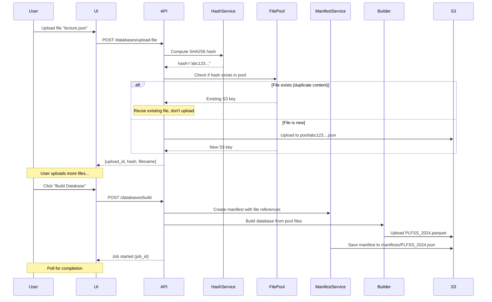
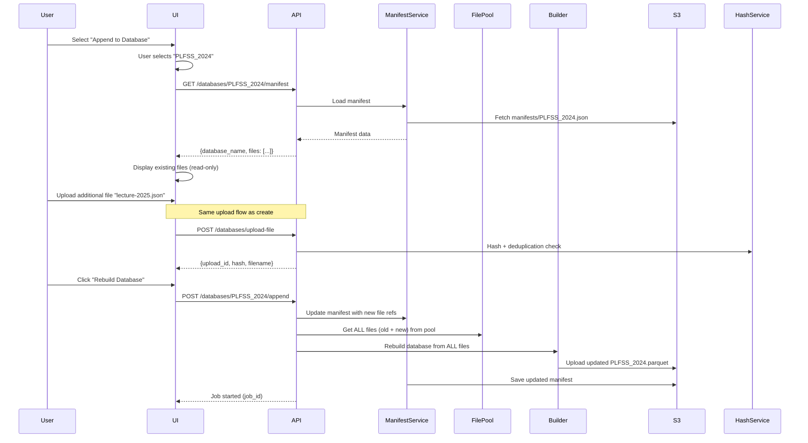

# Database File Reuse & Append Feature

## Overview

This document describes the architecture and implementation plan for enabling file reuse and database appending in the GRAAL similarity database system.

## Problem Statement

Currently, when building similarity databases:
- Only the final Parquet file is saved to S3
- Original input files (JSON/Excel) are deleted after processing
- Users cannot reuse previously uploaded files
- Users cannot append new files to existing databases without re-uploading everything

## Solution Architecture

### Core Concepts

1. **Input File Pool**: Centralized storage of all uploaded files on S3, organized by content hash
2. **Database Manifests**: JSON files tracking which input files belong to each database
3. **Hash-based Deduplication**: Files with identical content are stored only once
4. **Privacy Model**: Files are only visible within databases they belong to (no cross-database browsing)
5. **Full Rebuild on Append**: When appending, rebuild entire database to ensure proper clustering/deduplication

## S3 Storage Structure

```
s3://graal-dev-app/
├── config_graal/                    # Existing: Office configuration files
├── similarity_dbs/                  # Existing: Processed Parquet databases
├── input_files/                     # NEW: Input file management
│   ├── pool/                        # NEW: Content-addressed file storage
│   │   ├── abc123def456.json       # Files named by SHA256 hash
│   │   ├── 789ghi012jkl.json
│   │   ├── mno345pqr678.xlsx
│   │   └── ...
│   └── manifests/                   # NEW: Database manifests
│       ├── PLFSS_2024.json
│       ├── PLACSS_2023.json
│       └── ...
```

### Why Hash-based Storage?

- **Deduplication**: Identical files uploaded with different names are stored only once
- **Content Integrity**: Hash serves as content verification
- **Storage Efficiency**: Reduces S3 storage costs
- **Privacy**: Files are referenced by hash, not discoverable by browsing

## Manifest Schema

```json
{
  "database_name": "PLFSS_2024",
  "created_at": "2024-01-15T10:30:00Z",
  "last_updated_at": "2024-02-20T15:45:00Z",
  "input_files": [
    {
      "s3_key": "input_files/pool/abc123def456.json",
      "file_hash": "abc123def456",
      "user_provided_filename": "lecture-2024-01.json",
      "uploaded_at": "2024-01-15T10:30:00Z",
      "metadata": {
        "default_processing_timestamp": 1704067200,
        "origin_project": "PLFSS 2024"
      }
    },
    {
      "s3_key": "input_files/pool/789ghi012jkl.json",
      "file_hash": "789ghi012jkl",
      "user_provided_filename": "lecture-2024-02.json",
      "uploaded_at": "2024-01-20T14:15:00Z",
      "metadata": {
        "default_processing_timestamp": 1705680000,
        "origin_project": "PLFSS 2024"
      }
    }
  ],
  "parquet_output": "similarity_dbs/PLFSS_2024.parquet"
}
```

### Manifest Fields

| Field | Type | Description |
|-------|------|-------------|
| `database_name` | string | Name of the database |
| `created_at` | ISO 8601 timestamp | When database was first created |
| `last_updated_at` | ISO 8601 timestamp | When database was last rebuilt |
| `input_files` | array | List of input files used to build the database |
| `input_files[].s3_key` | string | Full S3 path to file in pool |
| `input_files[].file_hash` | string | SHA256 hash of file content |
| `input_files[].user_provided_filename` | string | Original filename provided by user |
| `input_files[].uploaded_at` | ISO 8601 timestamp | When file was uploaded |
| `input_files[].metadata` | object | Processing metadata (timestamp, project) |
| `parquet_output` | string | S3 path to output Parquet file |

## User Workflows

### Workflow 1: Creating a New Database



**Key Points:**
- Files are checked against pool before uploading (hash-based deduplication)
- Original filenames are preserved in manifest for display
- Temporary files are NOT deleted after build (stay in pool)
- Manifest links database to its input files

### Workflow 2: Appending to an Existing Database



**Key Points:**
- Existing files are loaded from manifest and displayed
- User uploads additional files (same deduplication as create)
- Database is rebuilt from scratch with ALL files (old + new)
- Full rebuild ensures proper clustering and deduplication
- Original files remain in pool (never deleted)

## Implementation Plan

### Phase 1: Core Infrastructure

#### 1.1 File Hashing Service

**File**: [`graal/utils/file_hash_service.py`](../graal/utils/file_hash_service.py)

```python
class FileHashService:
    """Service for computing file hashes for deduplication."""

    @staticmethod
    def compute_file_hash(file_path: Path) -> str:
        """Compute SHA256 hash of file content."""

    @staticmethod
    async def compute_file_hash_async(file_content: bytes) -> str:
        """Compute SHA256 hash of file content (async)."""

    @staticmethod
    def hash_to_s3_key(file_hash: str, original_filename: str) -> str:
        """Convert hash to S3 key with original extension."""
```

**Key Features:**
- SHA256 hashing for reliable content identification
- Support for both file paths and byte content
- Async support for API integration
- Preserves file extension for pool storage

#### 1.2 Manifest Service

**File**: [`graal/utils/manifest_service.py`](../graal/utils/manifest_service.py)

```python
class DatabaseManifest:
    """Data class representing a database manifest."""
    database_name: str
    created_at: datetime
    last_updated_at: datetime
    input_files: list[InputFileReference]
    parquet_output: str

class InputFileReference:
    """Data class for input file reference in manifest."""
    s3_key: str
    file_hash: str
    user_provided_filename: str
    uploaded_at: datetime
    metadata: dict

class ManifestService:
    """Service for managing database manifests."""

    async def create_manifest(
        self,
        database_name: str,
        input_files: list[InputFileReference],
        parquet_output: str
    ) -> DatabaseManifest:
        """Create a new database manifest."""

    async def load_manifest(self, database_name: str) -> DatabaseManifest:
        """Load manifest from S3."""

    async def update_manifest(
        self,
        database_name: str,
        additional_files: list[InputFileReference]
    ) -> DatabaseManifest:
        """Update existing manifest with additional files."""

    async def delete_manifest(self, database_name: str) -> None:
        """Delete manifest from S3."""

    async def manifest_exists(self, database_name: str) -> bool:
        """Check if manifest exists for database."""
```

**Key Features:**
- JSON serialization/deserialization
- S3 storage integration
- Validation of manifest structure
- Atomic updates (read-modify-write with error handling)

#### 1.3 Input File Pool Manager

**File**: [`graal/utils/input_file_pool_manager.py`](../graal/utils/input_file_pool_manager.py)

```python
class InputFilePoolManager:
    """Manager for input file pool operations."""

    async def file_exists_in_pool(self, file_hash: str) -> bool:
        """Check if file with given hash exists in pool."""

    async def upload_to_pool(
        self,
        file_content: bytes,
        file_hash: str,
        original_filename: str
    ) -> str:
        """Upload file to pool, returns S3 key."""

    async def download_from_pool(self, s3_key: str) -> bytes:
        """Download file content from pool."""

    async def get_pool_file_metadata(self, s3_key: str) -> dict:
        """Get metadata for file in pool."""

    def get_s3_key_for_hash(
        self,
        file_hash: str,
        original_filename: str
    ) -> str:
        """Generate S3 key for file based on hash."""
```

**Key Features:**
- Hash-based file storage
- Duplicate detection
- Efficient file transfer
- Metadata retrieval

### Phase 2: S3Service Updates

**File**: [`graal/utils/s3_service.py`](../graal/utils/s3_service.py)

**New Methods to Add:**

```python
class S3Service:
    # Existing methods...

    # New: Input file pool operations
    async def upload_to_input_pool(
        self,
        file_content: bytes,
        s3_key: str
    ) -> None:
        """Upload file to input file pool."""

    async def download_from_input_pool(self, s3_key: str) -> bytes:
        """Download file from input file pool."""

    async def file_exists_in_pool(self, s3_key: str) -> bool:
        """Check if file exists in input pool."""

    # New: Manifest operations
    async def upload_manifest(
        self,
        database_name: str,
        manifest_data: dict
    ) -> None:
        """Upload database manifest as JSON."""

    async def download_manifest(self, database_name: str) -> dict:
        """Download and parse database manifest."""

    async def manifest_exists(self, database_name: str) -> bool:
        """Check if manifest exists for database."""

    async def delete_manifest(self, database_name: str) -> None:
        """Delete database manifest."""
```

**Configuration Updates:**

Add new environment variables:
```bash
S3_INPUT_POOL_FOLDER="input_files/pool"
S3_MANIFEST_FOLDER="input_files/manifests"
```

### Phase 3: API Route Updates

#### 3.1 Update Upload Endpoint

**File**: [`graal/api/routes/database_builder.py`](../graal/api/routes/database_builder.py)

**Updated Endpoint**: `POST /databases/upload-file`

**Changes:**
1. Compute file hash before any processing
2. Check if file exists in pool
3. If exists: Return reference without uploading
4. If new: Upload to pool with hash-based name
5. Return upload_id, hash, and user's filename

**Response Schema:**
```json
{
  "upload_id": "unique-id",
  "filename": "lecture-2024-01.json",
  "file_hash": "abc123def456",
  "s3_key": "input_files/pool/abc123def456.json",
  "already_existed": false
}
```

#### 3.2 Update Build Endpoint

**File**: [`graal/api/routes/database_builder.py`](../graal/api/routes/database_builder.py)

**Updated Endpoint**: `POST /databases/build`

**Changes:**
1. After successful build, create manifest
2. Save manifest to S3
3. Don't delete uploaded files (they stay in pool)

#### 3.3 New Append Endpoint

**File**: [`graal/api/routes/database_builder.py`](../graal/api/routes/database_builder.py)

**New Endpoint**: `POST /databases/{database_name}/append`

**Request Schema:**
```json
{
  "file_references": [
    {
      "upload_id": "...",
      "filename": "...",
      "file_hash": "...",
      "metadata": {
        "default_processing_timestamp": 1704067200,
        "origin_project": "PLFSS 2024"
      }
    }
  ],
  "drop_empty_columns": ["Réponse"],
  "similarity_threshold": 0.99,
  "eps": 0.4,
  "group_by_columns": ["Lecture", "origin_project", "Num article"]
}
```

**Response**: Standard `ProcessingResponse` with job_id

**Process:**
1. Load existing manifest
2. Add new file references to manifest
3. Build database from ALL files (old + new) in pool
4. Upload new Parquet file
5. Save updated manifest

#### 3.4 New Manifest Retrieval Endpoint

**File**: [`graal/api/routes/database_builder.py`](../graal/api/routes/database_builder.py)

**New Endpoint**: `GET /databases/{database_name}/manifest`

**Response Schema:**
```json
{
  "database_name": "PLFSS_2024",
  "created_at": "2024-01-15T10:30:00Z",
  "last_updated_at": "2024-02-20T15:45:00Z",
  "files": [
    {
      "upload_id": "legacy-ref",
      "filename": "lecture-2024-01.json",
      "file_hash": "abc123def456",
      "uploaded_at": "2024-01-15T10:30:00Z",
      "metadata": {
        "default_processing_timestamp": 1704067200,
        "origin_project": "PLFSS 2024"
      }
    }
  ],
  "total_files": 2
}
```

### Phase 4: Database Builder Service Updates

**File**: [`graal/api/services/database_builder_service.py`](../graal/api/services/database_builder_service.py)

**Changes to `start_database_build`:**

1. Load files from pool instead of temporary directory
2. After successful build, create/save manifest
3. Don't delete files from pool

**New Method**: `start_database_append`

```python
async def start_database_append(
    self,
    job_id: str,
    database_name: str,
    additional_file_references: list[dict],
    config_file: str,
    drop_empty_columns: list[str],
    similarity_threshold: float,
    eps: float,
    group_by_columns: list[str],
) -> None:
    """Append files to existing database and rebuild."""
```

**Process:**
1. Load existing manifest
2. Combine existing files + new files
3. Download all files from pool
4. Build database from combined files
5. Upload new Parquet
6. Update manifest with new files and timestamp

### Phase 5: Frontend Updates

#### 5.1 Database Builder Component

**File**: [`frontend/src/components/DatabaseBuilder/DatabaseBuilder.tsx`](../frontend/src/components/DatabaseBuilder/DatabaseBuilder.tsx)

**Add Mode Selection:**
```typescript
type BuildMode = 'create' | 'append';

interface DatabaseBuilderState {
  mode: BuildMode;
  selectedDatabase?: string;
  existingFiles: FileReference[];
  newFiles: FileReference[];
}
```

**UI Changes:**
1. Add mode selector (Create New / Append to Existing)
2. When "Append" mode:
   - Show database dropdown
   - Load and display existing files (read-only list)
   - Allow uploading additional files
   - Change button text to "Rebuild Database"
3. When "Create" mode:
   - Current behavior

#### 5.2 API Service Updates

**File**: [`frontend/src/services/api.ts`](../frontend/src/services/api.ts)

**New Functions:**
```typescript
export async function getDatabaseManifest(
  databaseName: string
): Promise<DatabaseManifest> {
  // GET /databases/{databaseName}/manifest
}

export async function appendToDatabase(
  databaseName: string,
  request: AppendDatabaseRequest
): Promise<ProcessingResponse> {
  // POST /databases/{databaseName}/append
}
```

#### 5.3 Type Updates

**File**: [`frontend/src/types/api.ts`](../frontend/src/types/api.ts)

**New Types:**
```typescript
export interface DatabaseManifest {
  database_name: string;
  created_at: string;
  last_updated_at: string;
  files: FileReference[];
  total_files: number;
}

export interface FileReference {
  upload_id: string;
  filename: string;
  file_hash: string;
  uploaded_at: string;
  metadata: FileMetadata;
}

export interface AppendDatabaseRequest {
  file_references: FileReference[];
  drop_empty_columns: string[];
  similarity_threshold: number;
  eps: number;
  group_by_columns: string[];
}
```

### Phase 6: Error Handling & Edge Cases

#### 6.1 Manifest Corruption

**Scenario**: Manifest JSON is corrupted or invalid

**Handling:**
- Validate manifest schema on load
- If invalid, return 500 error with clear message
- Consider manifest versioning for future compatibility
- Log corruption for investigation

#### 6.2 Missing Pool Files

**Scenario**: Manifest references file that doesn't exist in pool

**Handling:**
- Validate all file references before building
- Return 400 error listing missing files
- Suggest recreating database from scratch
- Log issue for investigation

#### 6.3 Concurrent Builds

**Scenario**: Two users try to append to same database simultaneously

**Handling:**
- Use job queue to serialize builds for same database
- Or: Implement optimistic locking with manifest versioning
- Return 409 Conflict if concurrent modification detected

#### 6.4 Partial Upload Failures

**Scenario**: File upload to pool fails midway

**Handling:**
- Implement retry logic in upload
- Use multipart uploads for large files
- Return clear error to user if upload fails
- Don't create manifest entry for failed uploads

### Phase 7: Testing Strategy

#### 7.1 Unit Tests

**Test Files to Create:**
- `tests/unit/utils/file_hash_service_test.py`
- `tests/unit/utils/manifest_service_test.py`
- `tests/unit/utils/input_file_pool_manager_test.py`

**Test Coverage:**
- Hash computation correctness
- Duplicate file detection
- Manifest CRUD operations
- Pool file management
- Error handling

#### 7.2 Integration Tests

**Test Scenarios:**
1. Create new database with uploaded files
2. Append files to existing database
3. Upload duplicate file (verify deduplication)
4. Build database with files from pool
5. Handle missing manifest
6. Handle missing pool file
7. Concurrent append attempts

#### 7.3 Manual Testing Checklist

- [ ] Upload file → verify stored in pool with hash
- [ ] Upload same file again → verify not re-uploaded
- [ ] Create database → verify manifest created
- [ ] View database manifest → verify all files listed
- [ ] Append to database → verify old files preserved
- [ ] Rebuilt database contains all amendments
- [ ] Original filenames displayed correctly
- [ ] UI mode switching works correctly
- [ ] Error messages are clear and actionable

## Migration Strategy

### For Existing Databases

**Option A: No Migration (Recommended)**
- Existing databases continue to work as-is
- No append capability until they are rebuilt
- Simple and safe approach

**Option B: Generate Basic Manifests**
- Attempt to create manifests from existing metadata
- Complex and error-prone
- Not recommended

**Recommendation**: Use Option A. Existing databases work fine, new databases get new features.

### Communication to Users

"We've added the ability to reuse uploaded files and append to existing databases. To use these features with an existing database, rebuild it once. From then on, you can append new files without re-uploading everything."

## Environment Variables

Add to `.envrc` and documentation:

```bash
# Input file pool and manifests (optional, defaults shown)
S3_INPUT_POOL_FOLDER="input_files/pool"
S3_MANIFEST_FOLDER="input_files/manifests"
```

## API Documentation Updates

Update [`docs/api_documentation.md`](api_documentation.md) with:

1. New upload response schema (with hash)
2. New `/databases/{name}/manifest` endpoint
3. New `/databases/{name}/append` endpoint
4. Updated `/databases/build` behavior

## Summary

This architecture provides:

✅ **File Reuse**: Uploaded files stored permanently in pool
✅ **Deduplication**: Hash-based storage prevents duplicates
✅ **Database Appending**: Add files to existing databases without re-uploading
✅ **Privacy**: Files only visible within their databases
✅ **Consistency**: Full rebuilds ensure proper clustering
✅ **Simplicity**: Clear separation of create vs append workflows
✅ **Efficiency**: Reduces storage costs and upload times

## Implementation Checklist

### Phase 0: Preparation
- [ ] Review and approve this plan
- [ ] Create feature branch: `feature/database-file-reuse`
- [ ] Set up environment variables for new S3 folders

### Phase 1: Core Infrastructure

#### 1.1 File Hashing Service
- [ ] Create `graal/utils/file_hash_service.py`
- [ ] Implement `compute_file_hash()` for file paths
- [ ] Implement `compute_file_hash_async()` for byte content
- [ ] Implement `hash_to_s3_key()` helper
- [ ] Add unit tests in `tests/unit/utils/file_hash_service_test.py`

#### 1.2 Manifest Service
- [ ] Create `graal/utils/manifest_service.py`
- [ ] Define `DatabaseManifest` dataclass
- [ ] Define `InputFileReference` dataclass
- [ ] Implement `ManifestService.create_manifest()`
- [ ] Implement `ManifestService.load_manifest()`
- [ ] Implement `ManifestService.update_manifest()`
- [ ] Implement `ManifestService.delete_manifest()`
- [ ] Implement `ManifestService.manifest_exists()`
- [ ] Add JSON serialization/deserialization
- [ ] Add manifest validation logic
- [ ] Add unit tests in `tests/unit/utils/manifest_service_test.py`

#### 1.3 Input File Pool Manager
- [ ] Create `graal/utils/input_file_pool_manager.py`
- [ ] Implement `InputFilePoolManager.file_exists_in_pool()`
- [ ] Implement `InputFilePoolManager.upload_to_pool()`
- [ ] Implement `InputFilePoolManager.download_from_pool()`
- [ ] Implement `InputFilePoolManager.get_pool_file_metadata()`
- [ ] Implement `InputFilePoolManager.get_s3_key_for_hash()`
- [ ] Add unit tests in `tests/unit/utils/input_file_pool_manager_test.py`

### Phase 2: S3Service Updates

- [ ] Add `S3_INPUT_POOL_FOLDER` environment variable handling
- [ ] Add `S3_MANIFEST_FOLDER` environment variable handling
- [ ] Implement `S3Service.upload_to_input_pool()`
- [ ] Implement `S3Service.download_from_input_pool()`
- [ ] Implement `S3Service.file_exists_in_pool()`
- [ ] Implement `S3Service.upload_manifest()`
- [ ] Implement `S3Service.download_manifest()`
- [ ] Implement `S3Service.manifest_exists()`
- [ ] Implement `S3Service.delete_manifest()`
- [ ] Update unit tests for new methods

### Phase 3: API Routes Updates

#### 3.1 Update Upload Endpoint
- [ ] Modify `POST /databases/upload-file` to compute file hash
- [ ] Add pool existence check before upload
- [ ] Update response schema to include hash and S3 key
- [ ] Handle duplicate file detection (return existing reference)
- [ ] Update API models in `graal/api/models/responses.py`

#### 3.2 Update Build Endpoint
- [ ] Modify `POST /databases/build` to create manifest after build
- [ ] Save manifest to S3 after successful build
- [ ] Remove file deletion logic (files stay in pool)
- [ ] Update error handling for manifest creation

#### 3.3 New Append Endpoint
- [ ] Create `POST /databases/{database_name}/append` endpoint
- [ ] Add request validation for append operation
- [ ] Implement manifest loading and updating
- [ ] Trigger database rebuild with all files
- [ ] Add proper error handling
- [ ] Update API models in `graal/api/models/requests.py`

#### 3.4 New Manifest Retrieval Endpoint
- [ ] Create `GET /databases/{database_name}/manifest` endpoint
- [ ] Implement manifest loading and transformation
- [ ] Format response for frontend consumption
- [ ] Add error handling for missing manifests
- [ ] Update API models in `graal/api/models/responses.py`

### Phase 4: Database Builder Service Updates

- [ ] Update `DatabaseBuilderService.start_database_build()`
  - [ ] Load files from pool instead of temp directory
  - [ ] Create manifest after successful build
  - [ ] Don't delete files from pool
- [ ] Create `DatabaseBuilderService.start_database_append()`
  - [ ] Load existing manifest
  - [ ] Combine existing + new file references
  - [ ] Download all files from pool
  - [ ] Build database from combined files
  - [ ] Update manifest with new files
- [ ] Update job registry progress messages
- [ ] Add comprehensive error handling

### Phase 5: Frontend Updates

#### 5.1 Type Definitions
- [ ] Add `DatabaseManifest` interface to `frontend/src/types/api.ts`
- [ ] Add `FileReference` interface
- [ ] Add `AppendDatabaseRequest` interface
- [ ] Update generated types if using auto-generation

#### 5.2 API Service
- [ ] Add `getDatabaseManifest()` to `frontend/src/services/api.ts`
- [ ] Add `appendToDatabase()` to API service
- [ ] Update error handling for new endpoints

#### 5.3 Database Builder Component
- [ ] Add mode selection state (`create` | `append`)
- [ ] Create database selector dropdown for append mode
- [ ] Implement manifest loading when database selected
- [ ] Display existing files (read-only list)
- [ ] Update file upload handling to support both modes
- [ ] Change button text based on mode ("Build" vs "Rebuild")
- [ ] Update form validation for append mode
- [ ] Add loading states and error handling

### Phase 6: Error Handling & Edge Cases

- [ ] Add validation for corrupted manifests
- [ ] Handle missing pool files gracefully
- [ ] Implement concurrent build detection/queueing
- [ ] Add retry logic for failed S3 operations
- [ ] Add clear error messages for all failure scenarios
- [ ] Log all errors for debugging

### Phase 7: Testing

#### 7.1 Unit Tests
- [ ] File hash service tests (hash computation, S3 key generation)
- [ ] Manifest service tests (CRUD operations, validation)
- [ ] Pool manager tests (upload, download, deduplication)
- [ ] Updated S3Service tests for new methods

#### 7.2 Integration Tests
- [ ] Test: Create new database with file uploads
- [ ] Test: Upload duplicate file (verify deduplication)
- [ ] Test: Append files to existing database
- [ ] Test: Rebuild database contains all amendments
- [ ] Test: Handle missing manifest
- [ ] Test: Handle missing pool file
- [ ] Test: Concurrent append attempts

#### 7.3 Manual Testing
- [ ] Upload file → verify stored in pool with hash
- [ ] Upload same file twice → verify not re-uploaded
- [ ] Create database → verify manifest created
- [ ] View database manifest → verify all files listed
- [ ] Append to database → verify old files preserved
- [ ] Verify rebuilt database contains all amendments
- [ ] Verify original filenames displayed correctly
- [ ] Test UI mode switching
- [ ] Verify error messages are clear

### Phase 8: Documentation & Deployment

- [ ] Update `docs/api_documentation.md` with new endpoints
- [ ] Add migration notes to CHANGELOG.md
- [ ] Update README if needed
- [ ] Create deployment guide for S3 folder structure
- [ ] Update environment variable documentation
- [ ] Code review
- [ ] Merge to main branch
- [ ] Deploy to staging environment
- [ ] Staging smoke tests
- [ ] User acceptance testing
- [ ] Deploy to production
- [ ] Monitor for issues
